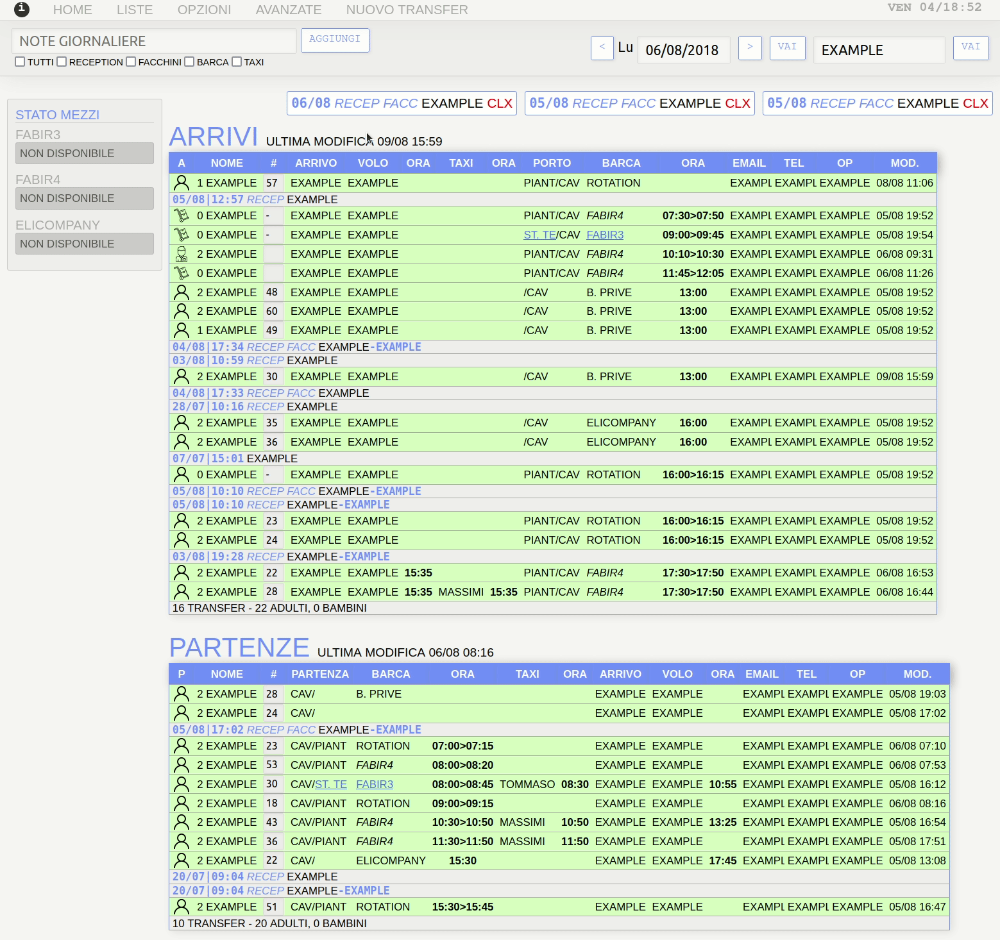

# Horrible Transfer System
This is a hotel transfer management system made by a young receptionist with no programming experience *in 2018*.
It's definitely not made to be used in production environments.
It has tons of (sometimes very basic) security issues and must not be used as it is (also due to very poor code design).
This repo has two versions of it `OLD_VERSION` (in PHP), and the new version at the root (with asynchronous calls for better UI/UX).

The newer version was never used in the hotel and has many features that are incomplete.

## A bit of context
In 2018 I've worked as receptionist for a hotel on a private island 🏝️
For all guests we took charge to book taxis from the airport to the nearest dock, were the hotel's boats shuttle them to island.
From there our staff should take them and bring them at the reception.
This task was extremely time consuming for our team (5 persons), done with Exel, and giving us a lot of struggle not to make mistakes.
I've then decided to create a little site in PHP (the `OLD_VERSION`). It helped us freeing time to take even better care of our guests and it greatly minimized errors throughout the season.
The name `7 days` was chosen because initially I tought it would take me 7 days to make it (it took me the double 🤓)
One year later, as an applied project when reading `AJAX and PHP: Building Modern Web Applications 2nd Edition`, I've tried to make the site more interactive using AJAX techniques to improve the UI and add more features.

## Features I'm proud of
- Personalized printed style by department
- Comments filtered by department
- Dynamic filters by transfer type
- Daily notes and transfer specific notes by department
- Boat status with timer

## How to use it (if you really want to)
If you want to test it you would need to:
- Create a new `MySql` database
- Import the basic tables structure in `risorse/structure.sql`
- Modify database credentials in `config.php`
- The default user for the website is `admin` and the password is `admin`
- To change the user you can edit `$usernames` and `$passwords` in `index.php`
- You are ready to enter some transfers 👍

## How to use the older version
The procedure is almost the same than for the new one, few noticeable differences are:
- The database credentials are in `OLD_VERSION/funzioni_admin.php`
- Many of the entries in the db are not used by the older version

## New version bugs
The new version was never mented to be used in production and stays with many bugs and some functionnalities only half implemented.  
As an exercise to learn AJAX this version was not polished and I stopped to develop it when I felt comfortable with the new technique I was learning.

## Requirements
Somehow the site still works on:
- PHP 7.4.3
- Mysql 8.0.28
- Apache 2.4.41

## License
[MIT License](https://choosealicense.com/licenses/mit/)